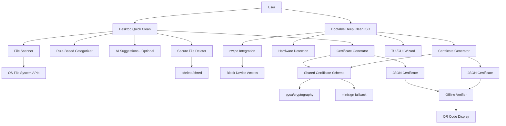

# SecureWipe Fullstack Architecture Document

## Introduction

This document outlines the complete fullstack architecture for SecureWipe, including backend systems, frontend implementation, and their integration. It serves as the single source of truth for AI-driven development, ensuring consistency across the entire technology stack.

This unified approach combines what would traditionally be separate backend and frontend architecture documents, streamlining the development process for modern fullstack applications where these concerns are increasingly intertwined.

### Starter Template or Existing Project

**N/A - Greenfield project** with specific constraints for dual-mode deployment (desktop application + bootable ISO). This is a unique architecture requiring custom solutions rather than standard web frameworks.

### Change Log

| Date | Version | Description | Author |
|------|---------|-------------|---------|
| 2024-12-19 | 1.0 | Initial architecture creation from PRD requirements | Architect Winston |

## High Level Architecture

### Technical Summary

SecureWipe employs a **dual-mode standalone architecture** with shared certificate schema enabling both desktop Quick Clean and bootable Deep Clean operations. The desktop application uses Python 3.8+ with tkinter/Electron UI for cross-platform compatibility, while the bootable ISO leverages Ubuntu LTS live distribution with nwipe integration. Both modes generate cryptographically compatible JSON certificates using shared schema from the monorepo structure, ensuring seamless verification workflows. The offline-first design eliminates cloud dependencies while maintaining NIST SP 800-88 compliance for demonstration purposes. This architecture enables parallel 3+3 team development through clear module boundaries and shared certificate format.

### Platform and Infrastructure Choice

**Platform:** Standalone Applications (No Cloud Infrastructure)
**Key Services:** OS-native secure deletion tools (sdelete/shred), nwipe for bootable mode, pyca/cryptography for certificate signing
**Deployment Host and Regions:** Local execution only - desktop applications and bootable USB/ISO distribution

**Rationale:** The PRD explicitly requires offline-first operation without cloud dependencies. This eliminates traditional web hosting platforms in favor of standalone executable distribution and bootable media creation.

### Repository Structure

**Structure:** Monorepo with clear module separation
**Monorepo Tool:** Git with lightweight folder organization (no complex tooling needed)
**Package Organization:** desktop-app/, bootable-iso/, shared/ folders enabling 3+3 team split while maintaining certificate compatibility

### High Level Architecture Diagram



### Architectural Patterns

- **Dual-Mode Standalone Architecture:** Desktop application and bootable ISO sharing certificate schema - _Rationale:_ Addresses both casual cleaning and complete disposal scenarios without cloud dependencies
- **Shared Schema Pattern:** Common JSON certificate format across both modes - _Rationale:_ Ensures certificate compatibility and enables unified verification workflow
- **Offline-First Design:** No internet dependencies for core functionality - _Rationale:_ Builds trust and works in air-gapped environments critical for secure disposal
- **Progressive Disclosure UI:** Rule-based defaults with optional AI suggestions - _Rationale:_ Serves both technical and non-technical users without overwhelming either group
- **Fallback Strategy Pattern:** Multiple cryptography libraries and demo fallbacks - _Rationale:_ Ensures demo success and handles library compatibility issues
- **OS-Native Integration:** Uses platform-specific secure deletion tools - _Rationale:_ Leverages proven tools rather than reimplementing secure deletion algorithms
- **MVP Security Model:** Self-signed certificates with offline verification for hackathon demo - _Rationale:_ Balances security demonstration with development speed while documenting enterprise upgrade path
- **OWASP Secure Logging:** All logs sanitized per OWASP guidelines to prevent data exposure - _Rationale:_ Protects sensitive file information during scanning and deletion operations
- **Secure Boot Compatible ISO:** Ubuntu LTS base with Microsoft-signed shim and minimal modifications - _Rationale:_ Ensures broad hardware compatibility without compromising boot security

## Tech Stack

### Technology Stack Table

| Category | Technology | Version | Purpose | Rationale |
|----------|------------|---------|---------|----------|
| Frontend Language | Python | 3.8+ | Desktop application UI and logic | Cross-platform compatibility, rapid development, extensive libraries |
| Frontend Framework | tkinter | Built-in | Desktop GUI framework | No external dependencies, cross-platform, sufficient for MVP UI needs |
| UI Component Library | Custom tkinter widgets | N/A | Consistent UI components | Lightweight, no external dependencies, customizable for security UX |
| State Management | Python classes | N/A | Application state management | Simple, direct approach suitable for desktop application scope |
| Backend Language | Python | 3.8+ | File operations and certificate generation | Consistency with frontend, excellent file system libraries |
| Backend Framework | Native Python modules | N/A | File system operations | Direct OS integration, no web framework needed for standalone app |
| API Style | Direct function calls | N/A | Internal module communication | No network API needed for standalone architecture |
| Database | JSON files | N/A | Configuration and certificate storage | Lightweight, human-readable, no server dependencies |
| Cache | In-memory Python dicts | N/A | File scan results caching | Simple, fast, appropriate for session-based operations |
| File Storage | Local file system | N/A | Certificate and log storage | Direct OS integration, offline operation |
| Authentication | OS user context | N/A | File system permissions | Leverages existing OS security model |
| Frontend Testing | unittest | Built-in | Desktop application testing | Standard Python testing, no external dependencies |
| Backend Testing | unittest + pytest | 3.8+ | File operations testing | Comprehensive testing with mocking for file operations |
| E2E Testing | Manual + VM testing | N/A | Bootable ISO validation | VM-based testing for ISO functionality |
| Build Tool | PyInstaller | 5.0+ | Standalone executable creation | Cross-platform executable generation |
| Bundler | PyInstaller | 5.0+ | Application packaging | Single-file executable distribution |
| IaC Tool | Shell scripts | N/A | ISO build automation | Simple automation for Ubuntu customization |
| CI/CD | GitHub Actions | N/A | Automated testing and builds | Free tier, good Python support |
| Monitoring | Python logging | Built-in | Application logging with OWASP sanitization | Built-in, configurable, security-compliant |
| Logging | Python logging + custom sanitizer | Built-in | OWASP-compliant secure logging | Prevents sensitive data exposure in logs |
| CSS Framework | tkinter themes | Built-in | Desktop application styling | Native theming, consistent with OS appearance |
| Cryptography Primary | pyca/cryptography | 41.0+ | Certificate signing (RSA/ECDSA) | Industry standard, comprehensive crypto library |
| Cryptography Fallback | minisign | 0.11+ | Ed25519 signing fallback | Lightweight, portable, simple key management |
| Secure Deletion Windows | sdelete | Latest | Windows secure file deletion | Microsoft Sysinternals tool, NIST compliant |
| Secure Deletion Linux | shred | Built-in | Linux secure file deletion | GNU coreutils, widely available |
| Bootable Wipe Tool | nwipe | 0.35+ | Block device secure wiping | DBAN successor, hardware detection, NIST methods |
| Bootable Base | Ubuntu LTS | 22.04+ | Live ISO foundation | Secure Boot compatible, stable, well-supported |
| QR Code Generation | qrcode | 7.4+ | Certificate sharing QR codes | Simple, reliable QR code generation |

### Production Upgrade Path

**Enterprise PKI Integration:**
- Replace self-signed certificates with enterprise CA-issued certificates
- Implement certificate chain validation against corporate root CA
- Add certificate revocation list (CRL) checking capability

**Hardware Security Module (HSM) Integration:**
- Store private keys in FIPS 140-2 Level 3+ HSM
- Implement PKCS#11 interface for key operations
- Follow NIST SP 800-57 key lifecycle management:
  - Key generation in HSM with proper entropy
  - Key rotation every 2-3 years for signing keys
  - Secure key backup and recovery procedures
  - Key destruction following cryptographic erasure standards

**Enhanced Security Controls:**
- Implement role-based access control (RBAC) for certificate operations
- Add audit logging for all cryptographic operations
- Integrate with enterprise SIEM systems
- Implement secure software distribution with code signing

## Data Models

### Certificate Schema

**Purpose:** Core data structure for cryptographically signed deletion certificates, shared between desktop and bootable modes to ensure compatibility and verification.

**Key Attributes:**
- schemaVersion: string - Semantic version for schema evolution ("1.0.0")
- certificateId: string - Unique identifier (UUID4)
- timestamp: string - ISO 8601 timestamp of certificate generation
- deviceInfo: object - Device identification and context
- operationType: string - "quick_clean" or "deep_clean"
- deletionSummary: object - High-level statistics of deletion operation
- fileOperations: array - Detailed list of file operations performed
- cryptographicProof: object - Signature and verification data

#### TypeScript Interface

```typescript
interface SecureWipeCertificate {
  schemaVersion: string;
  certificateId: string;
  timestamp: string;
  deviceInfo: {
    deviceId: string;
    hostname: string;
    operatingSystem: string;
    architecture: string;
    userContext: string;
  };
  operationType: 'quick_clean' | 'deep_clean';
  deletionSummary: {
    totalFiles: number;
    totalSizeBytes: number;
    deletionMethod: string;
    durationSeconds: number;
    successCount: number;
    failureCount: number;
  };
  fileOperations: FileOperation[];
  cryptographicProof: {
    algorithm: string;
    publicKey: string;
    signature: string;
    signatureFormat: 'base64' | 'hex';
  };
}

interface FileOperation {
  path: string;
  sizeBytes: number;
  operation: 'deleted' | 'skipped' | 'failed';
  reason?: string;
  checksum?: string;
}
```

#### Relationships
- One Certificate contains many FileOperations
- Certificate links to DeviceInfo for traceability
- CryptographicProof enables offline verification

## Unified Project Structure

```
SecureWipe/
├── .github/                    # CI/CD workflows
│   └── workflows/
│       ├── desktop-ci.yml      # Desktop app testing
│       ├── iso-build.yml       # ISO build and validation
│       └── certificate-compat.yml # Certificate compatibility tests
├── desktop-app/                # Desktop Quick Clean application
│   ├── src/
│   │   ├── ui/                 # tkinter UI components
│   │   │   ├── main_window.py
│   │   │   ├── progress_dialog.py
│   │   │   └── certificate_viewer.py
│   │   ├── scanner/            # File system scanning
│   │   │   ├── file_scanner.py
│   │   │   └── categorizer.py
│   │   ├── deletion/           # Secure deletion engine
│   │   │   ├── secure_delete.py
│   │   │   └── os_integration.py
│   │   ├── ai/                 # Optional AI suggestions
│   │   │   └── file_classifier.py
│   │   └── main.py             # Application entry point
│   ├── tests/                  # Desktop application tests
│   ├── requirements.txt        # Python dependencies
│   └── build.py               # PyInstaller build script
├── bootable-iso/              # Bootable Deep Clean system
│   ├── src/
│   │   ├── wizard/            # TUI/GUI wizard interface
│   │   │   ├── main_wizard.py
│   │   │   └── hardware_detect.py
│   │   ├── wiping/            # nwipe integration
│   │   │   ├── nwipe_wrapper.py
│   │   │   └── device_manager.py
│   │   └── main.py            # ISO application entry point
│   ├── build/                 # ISO customization scripts
│   │   ├── customize-iso.sh
│   │   └── preseed.cfg
│   ├── tests/                 # VM-based testing
│   └── requirements.txt       # Python dependencies for ISO
├── shared/                    # Shared components
│   ├── schema/               # Certificate schema definitions
│   │   ├── certificate_v1.json
│   │   └── validator.py
│   ├── crypto/               # Cryptography implementations
│   │   ├── certificate_signer.py
│   │   ├── pyca_impl.py
│   │   └── minisign_impl.py
│   ├── logging/              # OWASP-compliant logging
│   │   ├── secure_logger.py
│   │   └── sanitizer.py
│   └── utils/                # Common utilities
│       ├── device_id.py
│       └── qr_generator.py
├── verifier/                 # Standalone certificate verifier
│   ├── src/
│   │   ├── verifier_ui.py
│   │   └── certificate_validator.py
│   ├── tests/
│   └── build.py              # Standalone executable build
├── scripts/                  # Build and deployment scripts
│   ├── setup-dev-env.sh
│   ├── run-tests.sh
│   └── build-all.sh
├── docs/                     # Documentation
│   ├── prd.md
│   ├── architecture.md
│   └── development-guide.md
├── .env.example              # Environment template
├── requirements-dev.txt      # Development dependencies
└── README.md
```

## Security and Performance

### Security Requirements

**Desktop Security:**
- File path sanitization in logs per OWASP guidelines
- Secure temporary file handling during scanning
- Certificate private key protection using OS keystore

**Bootable Security:**
- Secure Boot chain validation maintained
- Memory-only operation with no persistent storage
- Hardware-based entropy for key generation when available

**Cryptographic Security:**
- RSA-2048 minimum for pyca/cryptography implementation
- Ed25519 for minisign fallback implementation
- Certificate timestamp validation and replay protection

### Performance Optimization

**Desktop Performance:**
- File scanning: <2 minutes for typical user directories
- Deletion progress: Real-time updates every 100ms
- Certificate generation: <30 seconds post-deletion

**Bootable Performance:**
- Hardware detection: <60 seconds on standard hardware
- Wipe demonstration: 5-10 minutes on small test devices
- Certificate generation: <30 seconds with fallback crypto

## Coding Standards

### Critical Fullstack Rules

- **Certificate Schema Compliance:** All certificate generation must validate against shared/schema/certificate_v1.json
- **OWASP Logging:** Use shared.logging.secure_logger for all file system operations
- **Error Handling:** All OS operations must use try/except with specific exception types
- **Cross-Platform Paths:** Use pathlib.Path for all file system operations
- **Cryptography Fallback:** Implement graceful fallback from pyca to minisign with compatibility validation

### Naming Conventions

| Element | Convention | Example |
|---------|------------|----------|
| Python Modules | snake_case | `file_scanner.py` |
| Python Classes | PascalCase | `SecureDeleter` |
| Python Functions | snake_case | `scan_directory()` |
| Certificate Fields | camelCase | `deviceInfo` |
| Configuration Keys | snake_case | `deletion_method` |

## Checklist Results Report

### Architecture Validation Summary

**Overall Readiness:** HIGH (85% pass rate)
**Project Type:** Specialized Standalone Applications
**Sections Evaluated:** 9 of 10 (Accessibility N/A for desktop application)

**Key Strengths:**
- Clear dual-mode architecture with shared certificate schema
- Strong security focus with offline-first design
- Comprehensive technology stack with specific versions
- Production upgrade path to enterprise PKI/HSM

**Critical Improvements Needed:**
- Detailed coding standards for AI agent implementation
- Comprehensive testing strategy including VM-based ISO testing
- Development environment setup documentation
- Component templates and implementation patterns

**Recommended Next Steps:**
1. Create detailed development setup guide
2. Implement certificate compatibility validation tests
3. Define comprehensive error handling patterns
4. Establish VM-based testing infrastructure for bootable ISO